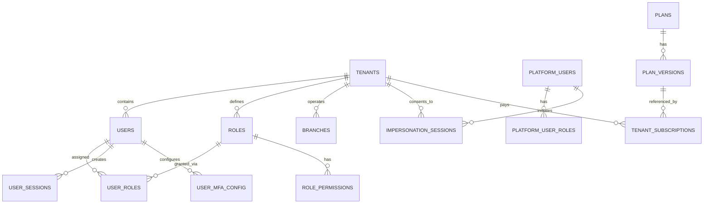
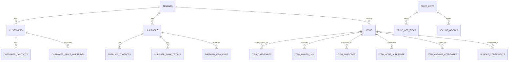
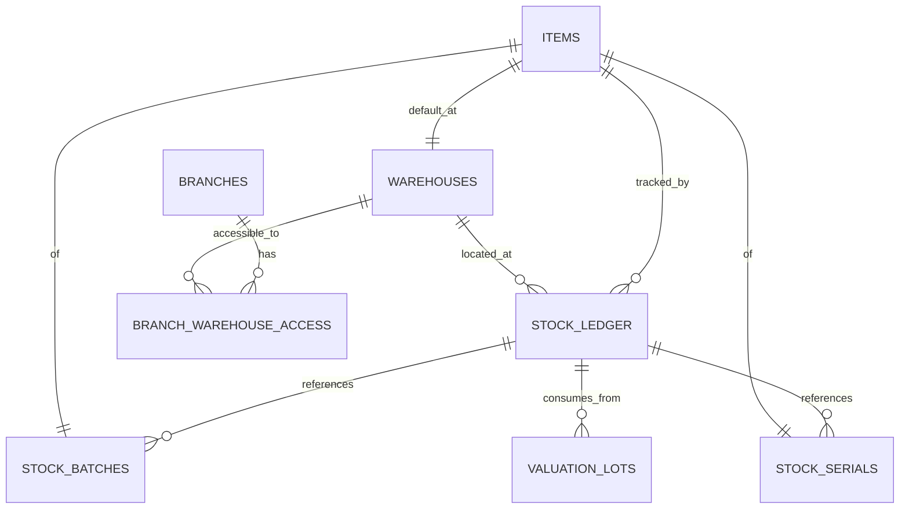
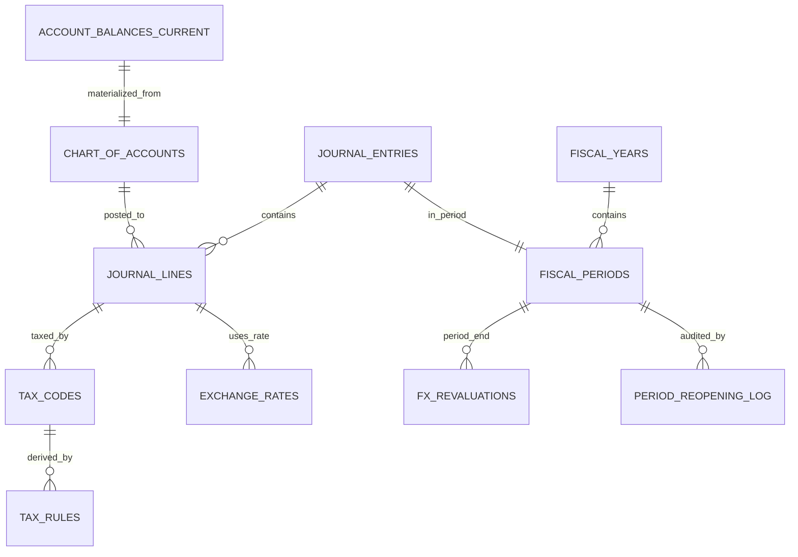
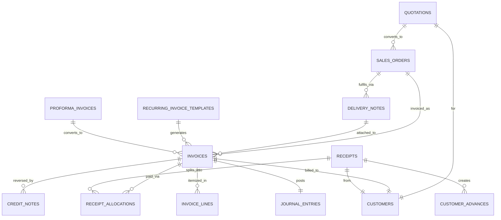
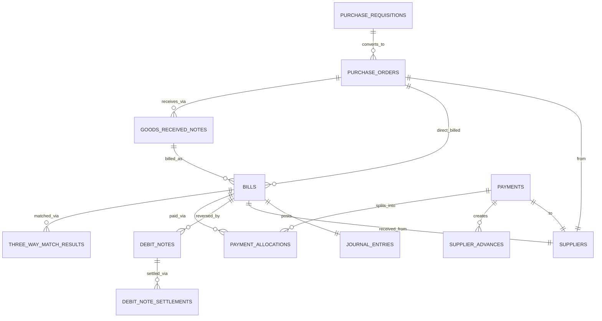
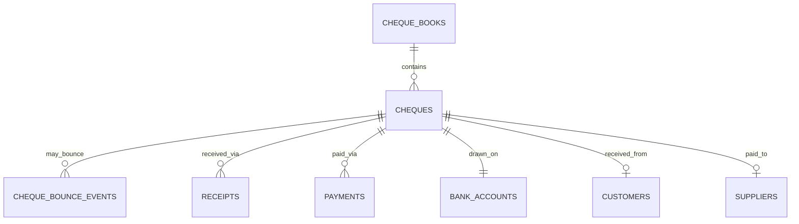
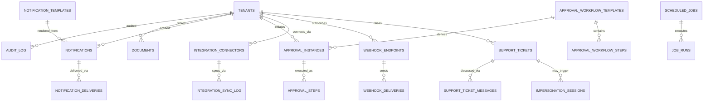

# Data Model — Part 8: Performance & ERDs

> The final piece. Partitioning strategies for tables at scale, index catalog with rationale, materialized views, Mermaid ERD diagrams for visual reference, complete RLS policy templates, query patterns to follow and anti-patterns to avoid, and capacity planning assumptions. Extends Parts 1-7. Target: Sri Lanka only. Scope: full system.

---

## 1. Scope

Defines:
- Partitioning strategy for high-volume tables
- Materialized view architecture
- Index strategy and catalog
- Complete RLS policy templates (production-ready)
- Common query patterns (do's and don'ts)
- Capacity planning assumptions
- Performance monitoring setup
- Mermaid ERD diagrams for key entity clusters

---

## 2. Partitioning Strategy

### 2.1 Tables Requiring Partitioning

| Table | Strategy | Rationale |
|---|---|---|
| `stock_ledger` | `tenant_id HASH (16) + occurred_at RANGE monthly` | Highest-write table; per-tenant queries dominate |
| `journal_entries` | `tenant_id HASH (16) + entry_date RANGE monthly` | Financial reporting queries per-tenant per-period |
| `journal_lines` | `tenant_id HASH (16) + entry_date RANGE monthly` | Parallel to entries; largest table by row count |
| `audit_log` | `tenant_id HASH (16) + occurred_at RANGE monthly` | High-volume write, time-series query pattern |
| `notification_deliveries` | `created_at RANGE monthly` | High volume, purged after 90 days |
| `user_login_history` | `attempted_at RANGE monthly` | Platform-level; retention-driven cleanup |
| `webhook_deliveries` | `created_at RANGE monthly` | High volume, 30-day retention |
| `job_runs` | `created_at RANGE monthly` | High volume, 90-day retention |

### 2.2 Two-Level Partitioning Example

```sql
-- Parent partitioned table
CREATE TABLE stock_ledger (
    id UUID NOT NULL,
    tenant_id UUID NOT NULL,
    -- ... columns as defined in Part 3 ...
    occurred_at TIMESTAMP WITH TIME ZONE NOT NULL,
    PRIMARY KEY (id, occurred_at, tenant_id)
) PARTITION BY HASH (tenant_id);

-- Hash sub-partitions (16 for tenant distribution)
CREATE TABLE stock_ledger_h00 PARTITION OF stock_ledger
    FOR VALUES WITH (modulus 16, remainder 0)
    PARTITION BY RANGE (occurred_at);

-- Similarly h01 through h15
-- Each hash sub-partition then partitioned by month

CREATE TABLE stock_ledger_h00_2026_04 PARTITION OF stock_ledger_h00
    FOR VALUES FROM ('2026-04-01') TO ('2026-05-01');

CREATE TABLE stock_ledger_h00_2026_05 PARTITION OF stock_ledger_h00
    FOR VALUES FROM ('2026-05-01') TO ('2026-06-01');

-- And so on for each hash bucket × each month
```

### 2.3 Partition Management

**Automation via scheduled job** (`job_type = 'partition_maintenance'`):

```sql
-- Runs monthly, creates partitions 6 months ahead
-- Drops partitions beyond retention period

-- Example auto-creation for stock_ledger:
DO $$
DECLARE
    v_month_start DATE := date_trunc('month', NOW() + INTERVAL '6 months')::DATE;
    v_month_end   DATE := v_month_start + INTERVAL '1 month';
    v_hash_bucket INTEGER;
    v_partition_name TEXT;
BEGIN
    FOR v_hash_bucket IN 0..15 LOOP
        v_partition_name := format('stock_ledger_h%s_%s',
            LPAD(v_hash_bucket::TEXT, 2, '0'),
            to_char(v_month_start, 'YYYY_MM'));
        EXECUTE format(
            'CREATE TABLE IF NOT EXISTS %I PARTITION OF stock_ledger_h%s FOR VALUES FROM (%L) TO (%L)',
            v_partition_name,
            LPAD(v_hash_bucket::TEXT, 2, '0'),
            v_month_start, v_month_end
        );
    END LOOP;
END $$;
```

**Partition dropping** for retention (example: audit_log 7 years):

```sql
-- Drop partitions older than 7 years
SELECT drop_partitions_older_than('audit_log', INTERVAL '7 years');
```

### 2.4 Query Performance Benefits

Partition pruning kicks in when WHERE clauses include partition key:

```sql
-- FAST: partition pruning both by tenant + time
SELECT * FROM journal_lines
WHERE tenant_id = '...' AND entry_date >= '2026-04-01' AND entry_date < '2026-05-01';

-- SLOW: no partition pruning (only time pruning)
SELECT * FROM journal_lines
WHERE entry_date >= '2026-04-01';  -- scans all 16 hash buckets for that month

-- VERY SLOW: no pruning at all
SELECT * FROM journal_lines WHERE account_id = '...';  -- scans every partition ever
```

**Rule**: always include `tenant_id` + time filter. Application-layer guarantees tenant filter always present.

---

## 3. Materialized Views

Critical for dashboard and report performance.

### 3.1 View Catalog

| View | Purpose | Refresh Strategy |
|---|---|---|
| `account_balances_current` | Current balance per account per currency | Incremental trigger + nightly full refresh |
| `account_balances_period` | Per-period historical balances | Populated at period close; manual refresh |
| `stock_balance_current` | Current qty + value per item per warehouse | Incremental trigger + nightly full refresh |
| `customer_ar_summary` | Per-customer AR aging (0-30-60-90-90+) | Hourly refresh |
| `supplier_ap_summary` | Per-supplier AP aging | Hourly refresh |
| `item_abc_xyz_classification` | Monthly ABC/XYZ computation | Monthly refresh (1st of each month) |
| `payroll_ytd_summary` | Per-employee YTD earnings/deductions | Refresh after each payroll posting |
| `sales_summary_daily` | Per-day sales aggregation | Nightly refresh |
| `purchase_summary_daily` | Per-day purchase aggregation | Nightly refresh |
| `tenant_usage_dashboard` | Platform dashboard tenant counts | Hourly refresh |

### 3.2 Example: Customer AR Aging

```sql
CREATE MATERIALIZED VIEW customer_ar_summary AS
SELECT
    i.tenant_id,
    i.customer_id,
    c.name AS customer_name,
    c.credit_limit_lkr,
    SUM(i.amount_outstanding_lkr) AS total_outstanding_lkr,
    SUM(CASE WHEN CURRENT_DATE <= i.due_date THEN i.amount_outstanding_lkr ELSE 0 END) AS not_yet_due_lkr,
    SUM(CASE WHEN CURRENT_DATE - i.due_date BETWEEN 1 AND 30 THEN i.amount_outstanding_lkr ELSE 0 END) AS overdue_1_30_lkr,
    SUM(CASE WHEN CURRENT_DATE - i.due_date BETWEEN 31 AND 60 THEN i.amount_outstanding_lkr ELSE 0 END) AS overdue_31_60_lkr,
    SUM(CASE WHEN CURRENT_DATE - i.due_date BETWEEN 61 AND 90 THEN i.amount_outstanding_lkr ELSE 0 END) AS overdue_61_90_lkr,
    SUM(CASE WHEN CURRENT_DATE - i.due_date > 90 THEN i.amount_outstanding_lkr ELSE 0 END) AS overdue_90_plus_lkr,
    COUNT(*) AS open_invoice_count,
    MAX(CURRENT_DATE - i.due_date) AS max_days_overdue,
    NOW() AS computed_at
FROM invoices i
JOIN customers c ON c.id = i.customer_id
WHERE i.status = 'posted' AND i.payment_status IN ('unpaid','partially_paid')
GROUP BY i.tenant_id, i.customer_id, c.name, c.credit_limit_lkr;

CREATE UNIQUE INDEX ON customer_ar_summary (tenant_id, customer_id);
CREATE INDEX ON customer_ar_summary (tenant_id, total_outstanding_lkr DESC);
CREATE INDEX ON customer_ar_summary (tenant_id, overdue_90_plus_lkr DESC) WHERE overdue_90_plus_lkr > 0;
```

Refreshed hourly via `REFRESH MATERIALIZED VIEW CONCURRENTLY customer_ar_summary`.

### 3.3 Incremental Refresh Pattern

For `account_balances_current`, use a trigger on `journal_lines`:

```sql
CREATE OR REPLACE FUNCTION update_account_balance()
RETURNS TRIGGER AS $$
BEGIN
    -- Simplified: update balance row for affected account
    INSERT INTO account_balances_current (tenant_id, account_id, currency, balance_lkr, ...)
    VALUES (NEW.tenant_id, NEW.account_id, NEW.currency, NEW.debit_lkr - NEW.credit_lkr, ...)
    ON CONFLICT (tenant_id, account_id, currency) DO UPDATE SET
        balance_lkr = account_balances_current.balance_lkr + EXCLUDED.balance_lkr,
        computed_at = NOW();
    RETURN NEW;
END;
$$ LANGUAGE plpgsql;

CREATE TRIGGER journal_lines_update_balance
    AFTER INSERT ON journal_lines
    FOR EACH ROW EXECUTE FUNCTION update_account_balance();
```

**Nightly full refresh** validates incremental state (drift detection).

---

## 4. Index Strategy

### 4.1 Index Categories

Every tenant-owned table gets:

1. **Tenant isolation index** — `(tenant_id, [other partition key if applicable])`
2. **Status filter index** — `(tenant_id, status)` where applicable
3. **Business key lookup** — `(tenant_id, business_number)` unique
4. **Foreign key reverse lookup** — `(tenant_id, referenced_id, relevant_date)`
5. **Search indexes** — GIN trigram for fuzzy text matching (names, descriptions)
6. **Partial indexes** — for filtered queries (e.g., unpaid invoices only)

### 4.2 Index Type Selection Guide

| Access Pattern | Index Type | Example |
|---|---|---|
| Exact match / range | B-tree (default) | `(tenant_id, invoice_date DESC)` |
| Text search fuzzy | GIN with `gin_trgm_ops` | `USING GIN (name gin_trgm_ops)` |
| Array contains | GIN | `USING GIN (tags)` / `USING GIN (subscribed_events)` |
| JSONB path query | GIN | `USING GIN (config_json jsonb_path_ops)` |
| Geo queries | GIST (if needed future) | n/a currently |

### 4.3 Partial Index Patterns

Common partial indexes already defined throughout:

```sql
-- Only active records
CREATE INDEX idx_customers_active ON customers (tenant_id, status)
    WHERE deleted_at IS NULL AND status = 'active';

-- Only unpaid invoices
CREATE INDEX idx_invoices_unpaid ON invoices (tenant_id, due_date)
    WHERE payment_status IN ('unpaid','partially_paid') AND status = 'posted';

-- Only open approvals (for "my queue" queries)
CREATE INDEX idx_approval_steps_pending_user ON approval_steps (tenant_id, approver_user_id)
    WHERE status = 'pending' AND approver_user_id IS NOT NULL;

-- Only negative stock (alerts)
CREATE INDEX idx_stock_balance_negative ON stock_balance_current (tenant_id, item_id)
    WHERE quantity_on_hand < 0;
```

### 4.4 Index Maintenance

Scheduled job runs weekly:
- `REINDEX CONCURRENTLY` on hot indexes showing bloat
- `ANALYZE` on tables with significant row changes
- Reports on unused indexes (candidates for removal)
- Alerts on indexes growing faster than tables

Use `pg_stat_user_indexes` and `pg_stat_statements` for monitoring.

---

## 5. Complete RLS Policy Templates

### 5.1 Standard Tenant Isolation (Used on Most Tables)

```sql
ALTER TABLE {table_name} ENABLE ROW LEVEL SECURITY;

-- Default: tenant isolation
CREATE POLICY tenant_isolation ON {table_name}
    FOR ALL
    USING (tenant_id = current_setting('app.current_tenant_id')::UUID);

-- Super admin bypass (platform ops only, explicitly enabled)
CREATE POLICY super_admin_access ON {table_name}
    FOR SELECT
    USING (current_setting('app.is_super_admin', true) = 'true');

-- Impersonation access (consent-required, time-bounded)
CREATE POLICY impersonation_access ON {table_name}
    FOR ALL
    USING (
        tenant_id = current_setting('app.current_tenant_id')::UUID
        AND current_setting('app.impersonation_session_id', true) != ''
    );
```

### 5.2 Platform Tables (No tenant_id)

```sql
-- Used on: platform_users, tenants, plans, platform_audit_log, etc.
ALTER TABLE {table_name} ENABLE ROW LEVEL SECURITY;

CREATE POLICY super_admin_only ON {table_name}
    FOR ALL
    USING (current_setting('app.is_super_admin', true) = 'true');
```

### 5.3 Nullable Tenant Tables

For tables where `tenant_id` can be NULL (platform-wide + tenant-override pattern):

```sql
-- Used on: notification_templates, scheduled_jobs, feature_flags
ALTER TABLE {table_name} ENABLE ROW LEVEL SECURITY;

CREATE POLICY tenant_isolation_nullable ON {table_name}
    FOR ALL
    USING (
        tenant_id IS NULL
        OR tenant_id = current_setting('app.current_tenant_id')::UUID
    );

CREATE POLICY super_admin_full ON {table_name}
    FOR ALL
    USING (current_setting('app.is_super_admin', true) = 'true');
```

### 5.4 Soft-Delete Invisibility

Applied as additional layer (not replacement):

```sql
-- Applied via application layer query builder by default:
-- SELECT * FROM customers
-- WHERE tenant_id = :tenant_id AND deleted_at IS NULL

-- OR via optional view:
CREATE OR REPLACE VIEW customers_active AS
SELECT * FROM customers WHERE deleted_at IS NULL;
```

Application layer controls visibility; RLS handles tenant isolation. Separation of concerns.

### 5.5 Connection Setup (Every Request)

```sql
-- At connection/request start, middleware executes:
SET LOCAL app.current_tenant_id = '<uuid-from-jwt>';
SET LOCAL app.current_user_id = '<uuid-from-jwt>';
SET LOCAL app.is_super_admin = '<true|false-from-jwt>';
SET LOCAL app.impersonation_session_id = '<uuid-or-empty>';
SET LOCAL app.request_id = '<uuid>';
```

`SET LOCAL` = transaction-scoped. Connection pooler (PgBouncer transaction mode) resets between checkouts.

---

## 6. Query Patterns

### 6.1 DO Patterns

**1. Always include tenant_id in WHERE clause**

```sql
-- GOOD
SELECT * FROM invoices
WHERE tenant_id = $1 AND customer_id = $2 AND status = 'posted'
ORDER BY invoice_date DESC LIMIT 50;
```

**2. Use partition key in time-series queries**

```sql
-- GOOD (partition pruning)
SELECT * FROM journal_lines
WHERE tenant_id = $1
  AND entry_date >= $2 AND entry_date < $3
  AND account_id = $4;
```

**3. Use materialized views for dashboards**

```sql
-- GOOD (fast)
SELECT * FROM customer_ar_summary WHERE tenant_id = $1
ORDER BY total_outstanding_lkr DESC LIMIT 20;

-- NOT THIS
SELECT customer_id, SUM(amount_outstanding_lkr)
FROM invoices WHERE tenant_id = $1 AND status = 'posted' GROUP BY customer_id;
```

**4. Use covering indexes for common SELECT columns**

```sql
-- Index includes all columns needed to satisfy query without heap lookup
CREATE INDEX idx_invoices_cover_list ON invoices (tenant_id, status, invoice_date DESC)
    INCLUDE (invoice_number, customer_id, grand_total_lkr);
```

**5. Batch inserts for bulk operations**

```sql
-- GOOD
INSERT INTO journal_lines (tenant_id, entry_id, account_id, debit_lkr, ...)
VALUES (...), (...), (...), ...;  -- multi-row

-- NOT THIS
-- Loop of single-row inserts
```

### 6.2 DON'T Patterns

**1. Don't query without tenant filter**

```sql
-- BAD: full table scan, RLS will return zero rows anyway (wasteful)
SELECT * FROM invoices WHERE customer_id = '...';

-- GOOD
SELECT * FROM invoices WHERE tenant_id = $1 AND customer_id = $2;
```

**2. Don't use SELECT * in production code**

```sql
-- BAD
SELECT * FROM journal_lines WHERE ...;

-- GOOD
SELECT id, account_id, debit_lkr, credit_lkr, narration FROM journal_lines WHERE ...;
```

**3. Don't join across tenants (impossible with RLS, but don't try)**

```sql
-- Won't even work with RLS, but semantically wrong anyway
SELECT * FROM invoices i JOIN platform_invoices pi ON i.customer_id = pi.tenant_id;
```

**4. Don't aggregate from raw transactional tables in hot paths**

```sql
-- BAD (scans all journal_lines for this period)
SELECT SUM(debit_lkr) FROM journal_lines
WHERE tenant_id = $1 AND account_id = $2 AND entry_date >= $3;

-- GOOD (uses materialized view)
SELECT balance_lkr FROM account_balances_current
WHERE tenant_id = $1 AND account_id = $2;
```

**5. Don't use LIKE '%foo%' without GIN**

```sql
-- BAD (full scan)
SELECT * FROM customers WHERE tenant_id = $1 AND name LIKE '%Silva%';

-- GOOD (GIN trigram index)
SELECT * FROM customers WHERE tenant_id = $1 AND name % 'Silva'
ORDER BY similarity(name, 'Silva') DESC;
```

---

## 7. Capacity Planning

### 7.1 Scale Assumptions (Year 3 Target)

- **Tenants**: 10,000 active (paid + trial)
- **Users per tenant (avg)**: 5
- **Invoices per tenant per month (avg)**: 200
- **GRNs per tenant per month (avg)**: 80
- **Stock movements per tenant per month (avg)**: 600
- **Journal lines per tenant per month (avg)**: 3,000
- **Audit events per tenant per month (avg)**: 10,000
- **Notifications per tenant per month (avg)**: 500

### 7.2 Row Volume Estimates (Year 3)

| Table | Rows/Month | 3-Year Total |
|---|---|---|
| `stock_ledger` | 6M | ~216M |
| `journal_lines` | 30M | ~1.08B |
| `audit_log` | 100M | ~3.6B |
| `invoices` | 2M | ~72M |
| `bills` | 600K | ~21M |
| `payroll_run_employee_lines` | 500K | ~18M |
| `notification_deliveries` | 5M (retained 90d) | ~15M active |
| `webhook_deliveries` | 1M (retained 30d) | ~1M active |

### 7.3 Storage Estimates

| Table | Avg Row Size | Year 3 Storage |
|---|---|---|
| `stock_ledger` | ~500 bytes | ~108 GB |
| `journal_lines` | ~400 bytes | ~430 GB |
| `audit_log` | ~800 bytes (JSONB payloads) | ~2.9 TB |
| `documents` metadata | ~1KB | ~100 GB |
| Document files (S3) | — | ~50 TB |

**Total DB storage**: ~4 TB (manageable with modern PostgreSQL on AWS Aurora or RDS).
**S3 storage**: ~50 TB (linearly scales with adoption).

### 7.4 Infrastructure Sizing

**Phase 1 (0-100 tenants, launch)**:
- Single PostgreSQL instance (db.r6g.xlarge or equivalent)
- Single app server (autoscaling group starting at 2 instances)
- Redis for session + BullMQ
- S3 for documents
- Monthly cost estimate: $500-1000

**Phase 2 (100-1000 tenants)**:
- PostgreSQL primary + read replica (db.r6g.2xlarge)
- 4-6 app servers
- Redis cluster (3 nodes)
- Monthly cost estimate: $2000-4000

**Phase 3 (1000-10000 tenants)**:
- Primary cluster (r6g.4xlarge) + 2 read replicas
- Auto-scaling app fleet (10-30 instances)
- Redis cluster (6 nodes)
- Consider read-replica routing for reports
- Monthly cost estimate: $8000-15000

**Phase 4 (10000+ tenants)**:
- Consider sharding (per-region if expanding beyond LK)
- Dedicated analytics replica
- Full CDN for document delivery
- Monthly cost estimate: $20000+

---

## 8. Performance Monitoring

### 8.1 Key Metrics to Track

**Database**:
- Connection pool utilization
- Query latency p50/p95/p99 per endpoint
- Transaction rate
- Dead tuple ratio (`pg_stat_user_tables`)
- Index hit ratio (should be > 99%)
- Cache hit ratio (should be > 95%)
- Replication lag
- Lock wait events

**Application**:
- API response time per endpoint
- Error rate per endpoint
- RLS violation attempts (security alert)
- Background job queue depth
- Background job failure rate
- Memory / CPU per service

**Business**:
- Tenant active count
- DAU / MAU
- Document uploads rate
- Search query rate

### 8.2 Query Performance Tooling

**Enable `pg_stat_statements`** (already in extensions list from Part 1):

```sql
-- Top slowest queries
SELECT
    substring(query for 100) AS query_preview,
    calls,
    total_exec_time::INTEGER AS total_ms,
    mean_exec_time::NUMERIC(10,2) AS mean_ms,
    max_exec_time::INTEGER AS max_ms
FROM pg_stat_statements
ORDER BY total_exec_time DESC
LIMIT 20;

-- Most frequent
SELECT query, calls, mean_exec_time FROM pg_stat_statements
ORDER BY calls DESC LIMIT 20;
```

**Enable auto_explain** for slow queries:

```sql
-- postgresql.conf
auto_explain.log_min_duration = 1000  -- log queries > 1 sec
auto_explain.log_analyze = on
auto_explain.log_buffers = on
```

### 8.3 Alert Thresholds

| Metric | Warning | Critical |
|---|---|---|
| API p95 latency | > 500ms | > 2000ms |
| DB connection pool usage | > 70% | > 90% |
| Cache hit ratio | < 95% | < 90% |
| Replication lag | > 30s | > 300s |
| Dead tuple ratio | > 10% | > 30% |
| Job queue depth | > 1000 | > 10000 |
| Job failure rate | > 1% | > 5% |
| Disk usage | > 70% | > 90% |

---

## 9. Mermaid ERD Diagrams

### 9.1 Core Tenant / Identity



### 9.2 Operations — Customers / Suppliers / Items



### 9.3 Stock Ledger Cluster



### 9.4 Accounting Spine



### 9.5 Sell-Side Transactions



### 9.6 Buy-Side Transactions



### 9.7 Cheques



### 9.8 Payroll

```mermaid
erDiagram
    EMPLOYEES ||--|| EMPLOYEE_PERSONAL_DETAILS : "has"
    EMPLOYEES ||--o{ EMPLOYEE_DEPENDENTS : "has"
    EMPLOYEES ||--o{ EMPLOYEE_BANK_DETAILS : "has"
    EMPLOYEES ||--o{ EMPLOYEE_SALARY_STRUCTURES : "assigned"
    EMPLOYEE_SALARY_STRUCTURES ||--o{ EMPLOYEE_SALARY_COMPONENTS : "configured"
    SALARY_COMPONENTS ||--o{ EMPLOYEE_SALARY_COMPONENTS : "instantiated"
    SALARY_STRUCTURE_TEMPLATES ||--o{ EMPLOYEE_SALARY_STRUCTURES : "templated"
    EMPLOYEES ||--o{ PAYROLL_RUN_EMPLOYEES : "included_in"
    PAYROLL_RUNS ||--o{ PAYROLL_RUN_EMPLOYEES : "contains"
    PAYROLL_RUN_EMPLOYEES ||--o{ PAYROLL_RUN_EMPLOYEE_LINES : "detailed_by"
    PAYROLL_RUN_EMPLOYEES ||--|| PAYSLIPS : "generates"
    PAYROLL_RUNS ||--o{ STATUTORY_RETURNS : "feeds"
    PAYROLL_RUNS ||--|| DISBURSEMENT_FILES : "disbursed_via"
    EMPLOYEES ||--o{ EMPLOYEE_LOANS : "borrows"
    EMPLOYEE_LOANS ||--o{ LOAN_REPAYMENT_SCHEDULE : "amortized"
    EMPLOYEE_LOANS ||--o{ LOAN_PAYMENTS : "repaid_via"
    EMPLOYEES ||--o{ LEAVE_APPLICATIONS : "applies"
    LEAVE_TYPES ||--o{ EMPLOYEE_LEAVE_BALANCES : "accrued"
    EMPLOYEES ||--o{ EXPENSE_CLAIMS : "submits"
    EMPLOYEES ||--|| FINAL_SETTLEMENTS : "exits_via"
```



### 9.9 System / Cross-Cutting



---

## 10. Connection Management

### 10.1 Connection Pool Configuration

**PgBouncer** in transaction mode:

```
[databases]
production = host=... port=5432 dbname=app_production

[pgbouncer]
pool_mode = transaction
max_client_conn = 5000
default_pool_size = 25
reserve_pool_size = 10
reserve_pool_timeout = 5
server_idle_timeout = 600
```

**Rationale**:
- Transaction mode required for `SET LOCAL` to work correctly
- `max_client_conn = 5000` serves many app instances
- `default_pool_size = 25` per app instance × ~200 instances max

### 10.2 Session vs Transaction Mode

- **Session mode**: connection reserved per client. Works for prepared statements but limits scale.
- **Transaction mode**: connection released after each transaction. Required for RLS via `SET LOCAL`. Prepared statements don't persist — app uses unprepared queries or re-prepares.

**We use transaction mode** for tenant isolation.

### 10.3 Read Replicas (Phase 2+)

When reads overwhelm primary:
- Route reports, dashboards, AR/AP aging to read replicas
- Writes always to primary
- Application config flag per query: `@ReadReplica` annotation or similar
- Eventual consistency acceptable for reports (< 1 sec replication lag typical)

---

## 11. Backup & Recovery

### 11.1 Backup Strategy

| Type | Frequency | Retention | RPO | RTO |
|---|---|---|---|---|
| Continuous WAL archiving | Real-time | 30 days | 1 min | — |
| Snapshot (automated) | Daily | 30 days | 24 hours | 1-2 hours |
| Cross-region replica | Real-time | Always | 1 min | 15 min |
| Annual archive | Yearly | 7 years | — | Days |

### 11.2 Tenant-Level Recovery

Full DB restore not practical for single tenant issue. Approach:
- Audit log enables reverting specific changes via compensating transactions
- Tenant data export gives tenant their data for local backup
- Data archive per tenant on termination

### 11.3 Disaster Recovery Test

Quarterly DR drill:
- Restore from snapshot to fresh environment
- Validate data integrity
- Test application bootstrap against restored DB
- Document RTO actually achieved

---

## 12. Security Hardening Checklist

Beyond what's already specified:

- [ ] All database connections via TLS (enforce `require` mode)
- [ ] Row-level encryption for sensitive columns (NIC, bank account numbers, passwords, TOTP secrets) using `pgcrypto` with KMS-managed keys
- [ ] Column-level access control (revoke SELECT on sensitive columns from app role; use SECURITY DEFINER functions)
- [ ] Audit all direct DB access (not just application-level access)
- [ ] Rotate DB passwords via secrets manager every 90 days
- [ ] Separate DB roles: `app_user` (tenant-scoped), `migration_user` (DDL), `readonly_reports` (for analytics)
- [ ] DDL operations require approval workflow in production
- [ ] Penetration testing quarterly
- [ ] RLS policy tests in CI (cross-tenant access attempts)
- [ ] Automated scanning for accidental PII in logs

---

## 13. Data Model Complete

This concludes the 8-part data model specification. All 8 files:

1. **Part 1 — Foundation** — Multi-tenancy, RLS, UUID v7, soft delete, audit columns
2. **Part 2 — Identity & Access** — Platform, tenants, users, roles, permissions, sessions, MFA
3. **Part 3 — Operations** — Branches, warehouses, customers, suppliers, items, stock ledger, pricing
4. **Part 4 — Accounting** — COA, journal entries/lines, tax codes, fiscal periods, FX
5. **Part 5 — Transactions** — Sell/buy documents, 3-way matching, cheques, approvals, numbering, document links
6. **Part 6 — Payroll & HR** — Employees, salary structures, payroll runs, payslips, statutory, leave, loans, bonuses, expense claims, final settlements
7. **Part 7 — System** — Audit log, documents, notifications, workflow templates, integrations, billing, feature flags, jobs, support, content, migrations
8. **Part 8 — Performance & ERDs** — Partitioning, materialized views, indexes, RLS templates, query patterns, capacity planning, ERD diagrams

**Total**: ~180 tables across all 8 parts, covering a complete multi-tenant cloud accounting SaaS for the Sri Lankan SME market.

---

## 14. Next Steps Beyond Data Model

Remaining workstreams (outside data model):

- **UX mockups** (user decision): actual HTML/React artifacts for core flows (signup → dashboard → first invoice → close of period)
- **Migration flow IA** (deferred): information architecture for the BUSY/Tally migration assistant
- **API specification**: OpenAPI spec for all endpoints
- **Integration specifications**: biometric device formats, bank file formats, IRD export formats
- **Testing strategy**: unit / integration / E2E / load / security test plans
- **Deployment & DevOps**: infrastructure-as-code (Terraform), CI/CD, monitoring setup
- **Rollout plan**: phased release, pilot tenants, feedback loops

---

*Document version: 1.0 · Part 8/8 · Performance & ERDs · Scope: Sri Lanka only · Full system (not MVP)*

*Decisions documented in Round 7-8 packaging (all recommended approaches adopted): two-level partitioning (tenant_id HASH 16 + RANGE monthly) on stock_ledger, journal_entries, journal_lines, audit_log; single-level monthly partitioning on high-volume append-only tables (notification_deliveries, webhook_deliveries, job_runs, user_login_history); 10 materialized views with mixed refresh strategies (trigger incremental + nightly full + scheduled periodic); full RLS policy library with 4 patterns (tenant isolation, platform-only, nullable tenant, super admin bypass); 3-year row volume estimates projecting ~4TB DB + ~50TB S3; PgBouncer transaction mode for RLS compatibility; phased infrastructure scaling Phase 1-4; backup strategy with WAL archiving + daily snapshots + cross-region replica + annual archives; security hardening checklist with TLS enforcement, row-level encryption via pgcrypto, separated DB roles, RLS policy tests in CI; 9 ERD clusters visualizing core relationships.*
